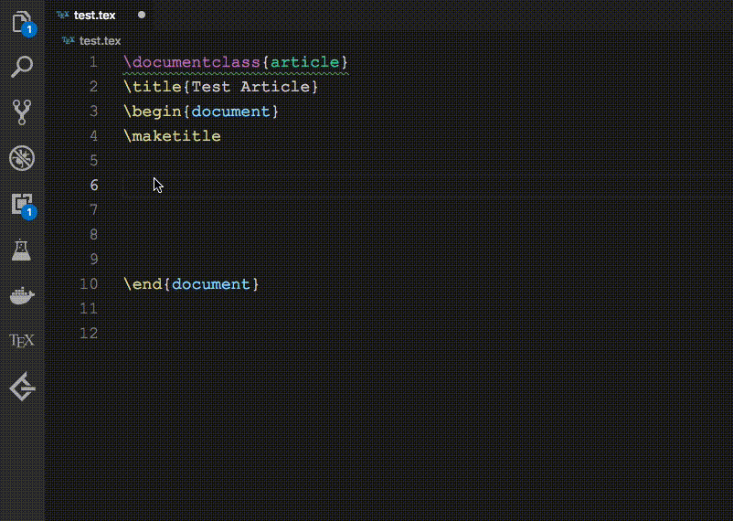

# LaTex Table Helper

LaTex Table Helper provides an easier way to create tables in latex documents.

## Features

This extension will become activated after opening a LaTex project.

Just type `\table <rows> <columns> <caption>` and select `Latex: Create table` in right click menu, this extension will generate a simple latex table automatically.

**Caution: Edit cursor and the "\table..." command must be in the same line.**

## Extension Settings

Can't be disabled right now. Not really necessary :)

## Release Notes

### 1.0.0

Initial release of LaTex Table Helper

### For more information

* [GitHub link](https://github.com/YLonely/latex-table-helper)

**Enjoy!**
